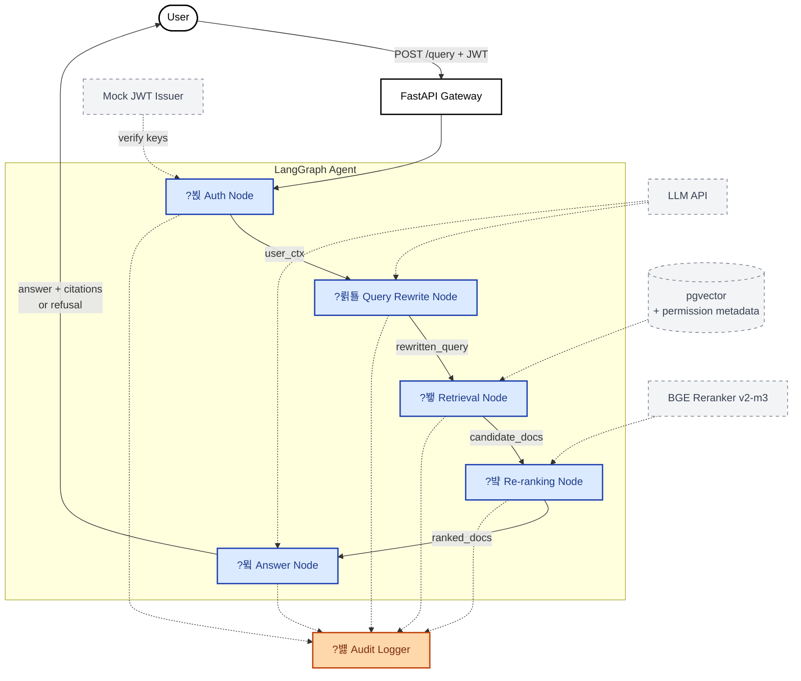

---
title: Permission Aware RAG
emoji: ?뵍
colorFrom: indigo
colorTo: blue
sdk: docker
app_port: 7860
pinned: false
short_description: Permission-aware retrieval (RBAC + ReBAC + ABAC)
---

# permission-aware-rag

> Permission-aware RAG with LangGraph for enterprise document search

?뷀꽣?꾨씪?댁쫰 ?섍꼍?먯꽌 ?ъ슜?먯쓽 IAM 沅뚰븳(??븷쨌?띿꽦)???곕씪 寃€??媛€?ν븳 臾몄꽌 踰붿쐞媛€ ?숈쟻?쇰줈 ?щ씪吏€?? LangGraph 湲곕컲 硫€?곗뿉?댁쟾??RAG ?쒖뒪??

## ?????꾨줈?앺듃?멸?

?뷀꽣?꾨씪?댁쫰 ?몄쬆 ?명봽??ADFS, SAML, OIDC)瑜??ㅻ뀈媛??댁쁺?섎ʼn 愿€李고븳 ??媛€吏€ 怨듬갚 ???€遺€遺꾩쓽 RAG ?덊띁?곗뒪 援ы쁽?€ *"?꾧뎄??紐⑤뱺 臾몄꽌瑜?寃€?됲븷 ???덈떎"*??媛€???꾩뿉???숈옉?⑸땲?? ?ㅼ젣 湲곗뾽 ?섍꼍?먯꽌???ъ슜?먯쓽 ??븷(role)怨??띿꽦(attribute)???곕씪 ?묎렐 媛€?ν븳 臾몄꽌媛€ ?щ씪???섍퀬, ??李⑥씠媛€ 寃€??寃곌낵쨌?듬? ?덉쭏쨌媛먯궗 濡쒓렇??紐⑤몢 諛섏쁺?섏뼱???⑸땲??

???꾨줈?앺듃??洹?怨듬갚??硫붿슦湲??꾪븳 ?ㅽ뿕?낅땲?? ReBAC쨌ABAC 媛숈? IAM 沅뚰븳 紐⑤뜽??RAG ?뚯씠?꾨씪?몄뿉 ?듯빀?섎뒗 ?ㅼ뼇??諛⑹떇(硫뷀??곗씠???ъ쟾 ?꾪꽣留? 寃€?????꾪꽣留? 沅뚰븳 媛€以묒튂 諛섏쁺)??吏곸젒 援ы쁽쨌痢≪젙쨌鍮꾧탳?⑸땲??

> **李멸퀬**: 蹂??꾨줈?앺듃??媛€?곸쓽 ?뚯궗 "BWCorp"瑜??쒕굹由ъ삤濡??ъ슜?섎ʼn, IdP??FastAPI 湲곕컲 mock JWT issuer濡??쒕??덉씠?섑빀?덈떎. ?ㅼ젣 IdP ?듯빀(Keycloak)?€ stretch goal濡??ㅻ９?덈떎. ??ADFS/AD ?명봽??援ъ텞?€ 蹂??꾨줈?앺듃??RAG 蹂몄쭏???먮━怨??쒓컙 鍮꾩슜 ?€鍮??⑥슜????떎怨??먮떒???섎룄?곸쑝濡??쒖쇅?덉뒿?덈떎.

## System Architecture

LangGraph 湲곕컲 硫€?곗뿉?댁쟾??援ъ꽦:

- **Auth Node** ??JWT 寃€利? ?ъ슜????븷쨌?띿꽦 異붿텧
- **Query Rewrite Node** ??沅뚰븳 而⑦뀓?ㅽ듃瑜?諛섏쁺??荑쇰━ ?ъ옉??
- **Retrieval Node** ??Vector DB?먯꽌 沅뚰븳 硫뷀??곗씠???꾪꽣留?+ ?섎?寃€??
- **Re-ranking Node** ??BGE Reranker 湲곕컲 沅뚰븳쨌愿€?⑤룄 醫낇빀 ?먯닔
- **Answer Node** ??Citation ?ы븿 ?듬? ?앹꽦, 沅뚰븳 遺€議???嫄곕? ?묐떟
- **Audit Logger** ??紐⑤뱺 寃€?됀룸떟蹂€ 媛먯궗 濡쒓렇

> 紐⑤뱺 ?몃뱶???낆텧?μ? 蹂꾨룄??**Audit Logger**??湲곕줉?섏뼱 沅뚰븳 異붿쟻怨??ы썑 媛먯궗瑜?吏€?먰빀?덈떎 (?ㅼ씠?닿렇???⑥닚?붾? ?꾪빐 ?쇰? ?곌껐???앸왂).

## Tech Stack

- **Language**: Python 3.13
- **Backend**: FastAPI, LangGraph, LangChain
- **Vector DB**: pgvector (primary), Qdrant (comparison experiment)
- **Re-ranker**: BGE Reranker v2-m3
- **Tracing**: Langfuse or LangSmith
- **Infra**: Hugging Face Spaces (Docker), Supabase (managed Postgres + pgvector)
- **CI/CD**: GitHub Actions

## Roadmap

- [x] **M1: Foundation** ??repo ?뗭뾽, ?쒖뒪???ㅺ퀎, BWCorp ?쒕굹由ъ삤쨌?곗씠???ㅽ럺, LangGraph 湲곗큹
- [x] **M2: MVP** ??FastAPI + pgvector + JWT ?몄쬆 + 沅뚰븳 ?꾪꽣留?+ LangGraph 湲곕낯 ?몃뱶 e2e
- [x] **M3: Re-ranking & Evaluation** ??BGE Reranker, RAGAS ?ㅽ????됯?, 沅뚰븳 ?꾩닔 ?뚯뒪??
- [x] **M4: Production Readiness** ??sensitivity 湲곕컲 沅뚰븳 紐⑤뜽 留덉씠洹몃젅?댁뀡, 蹂댁븞 ?섎뱶?? Hugging Face Spaces + Supabase 諛고룷
- [ ] **M5: Polish & Launch** ??README 由щ씪?댄듃, ?곕え ?곸긽, ?꾪궎?띿쿂 臾몄꽌

## Blog Series

吏꾪뻾 怨쇱젙怨??섏궗寃곗젙 湲곕줉??釉붾줈洹몄뿉 怨듦컻?⑸땲????[parkjongmin-ddam.github.io](https://parkjongmin-ddam.github.io)

- [x] 1?? ?ㅺ퀎?€ 援ы쁽 (M1+M2)
- [x] 2?? Reranker, audit log 踰꾧렇, schema drift (M3)
- [ ] 3?? 諛고룷 諛??댁쁺 ?뚭퀬 (M4+M5)

## Setup

> 濡쒖뺄 媛쒕컻 ?섍꼍 ?뗭뾽 媛€?대뱶??M5?먯꽌 ?뺣━ ?덉젙. ?듭떖 ?먮쫫:
> 1. `docker compose up` ?쇰줈 濡쒖뺄 pgvector 湲곕룞 (?먮뒗 Supabase ?곌껐)
> 2. `.env` ??`DATABASE_URL`, `JWT_SECRET_KEY` ?ㅼ젙
> 3. `uv run python scripts/ingest.py` 濡?臾몄꽌 + ?꾨쿋???곸옱
> 4. `uv run uvicorn permission_aware_rag.main:app` 濡?API 湲곕룞

## License

[MIT](LICENSE)
