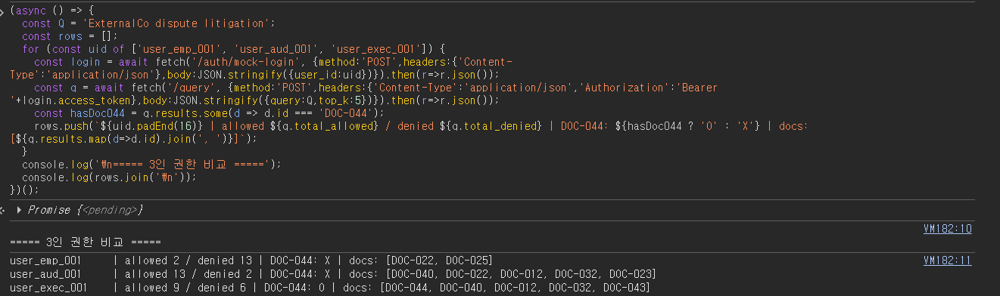

---
title: Permission Aware RAG
colorFrom: indigo
colorTo: blue
sdk: docker
app_port: 7860
pinned: false
short_description: Permission-aware retrieval (RBAC + ReBAC + ABAC)
---

# permission-aware-rag

> 사용자의 신원·역할·관계에 따라 **검색 결과와 생성 답변이 동적으로 달라지는** 엔터프라이즈 RAG.
> 같은 질문이라도 권한이 없는 문서는 검색에서 걸러지고, 생성 모델에도 전달되지 않는다.


---

## 왜 이 프로젝트인가

엔터프라이즈 인증 인프라(ADFS, SAML, OIDC)를 다년간 운영하며 관찰한 공백 — 대부분의 RAG 레퍼런스 구현은 *"누구나 모든 문서를 검색할 수 있다"*는 가정 위에서 동작한다. 실제 기업 환경에서는 사용자의 역할(role)·속성(attribute)·관계(relationship)에 따라 접근 가능한 문서가 달라야 하고, 이 차이가 검색 결과·생성 답변·감사 로그에 모두 일관되게 반영되어야 한다.

이 프로젝트는 IAM 권한 모델(RBAC·ReBAC·ABAC)을 RAG 파이프라인에 통합해, **권한 필터링을 검색과 생성의 가운데에 배치**한다. 핵심 불변식은 단순하다:

```
검색 → 재순위 → 권한 필터(can_read) → 통과한 문서만 → LLM 생성
```

권한 필터가 LLM **앞**에 있으므로, 사용자가 읽을 수 없는 문서는 애초에 생성 모델의 컨텍스트에 들어가지 않는다. 따라서 권한 없는 정보가 답변으로 누출되는 일이 구조적으로 불가능하다.

이 설계는 특히 **외부 LLM API 호출과 데이터 반출이 통제되는 환경**(망분리, DLP, API 키 거버넌스)을 염두에 둔 것이다. 그런 환경에서 RAG 도입의 가장 큰 우려는 *"사내 문서를 LLM에 물렸을 때 권한 없는 사람에게 기밀이 새지 않는가"*이다. 권한 필터를 생성 앞에 두면, 권한 경계가 곧 데이터 반출 통제 지점이 된다 — 권한 범위를 벗어난 문서는 외부 API든 온프레미스 모델이든 어떤 LLM에도 전달되지 않는다.

> **시나리오**: 가상 회사 "BWCorp"의 45개 문서(HR, 보안, 법무, 재무, 기술 등)를 사용한다. IdP는 FastAPI 기반 mock JWT issuer로 시뮬레이션한다. 실제 IdP 통합(Keycloak 등)이나 ADFS/AD 인프라 구축은, RAG 권한 모델이라는 본질을 흐린다고 판단해 의도적으로 범위에서 제외했다.

---

## 핵심 데모 — 같은 질문, 세 사람, 세 결과

질의 **"ExternalCo dispute litigation"** 를 권한이 다른 세 사용자가 던졌을 때 (`POST /query` · `POST /answer`, 클라우드 라이브):

| | 일반직원 (`emp_001`) | 외부 감사인 (`aud_001`) | 임원 (`exec_001`) |
|---|---|---|---|
| allowed / denied | **2 / 13** | 13 / 2 | 9 / 6 |
| `DOC-044` (소송, *privileged*) | ❌ | ❌ | ✅ |
| `/answer` 인용 문서 | `DOC-022` | `DOC-040`, `DOC-012` | `DOC-044`, `DOC-040`, `DOC-012` |
| 생성된 답변 | "권한 내 문서에 소송 정보 없음 — 있다면 권한 밖" | 계약 조항·보안 인시던트 (소송 금액 없음) | 소송 금액 1.2억·위험 평가·합의 전략 |



같은 질문이지만 결과가 권한에 따라 단계적으로 갈린다.

- **일반직원**: 15개 후보 중 13개가 차단된다. ExternalCo 관련 공개 계약 문서(`DOC-022`)는 보지만 소송 문서는 없다. LLM은 가진 문서만 보고 *"소송 정보는 없으며, 있다면 접근 권한 밖일 것"* 이라고 정직하게 답한다.
- **감사인**: 감사 범위(`audit_engagement_id`) 덕에 오히려 더 많이 본다(allowed 13). 하지만 `DOC-044`만은 *privileged* — attorney-client privilege로 `audit_rule`이 차단한다. 감사라도 소송 특권 문서는 못 본다.
- **임원**: 본인이 그 소송 당사자라 `parties_rule`로 `DOC-044`를 보고, 답변에 소송 금액·위험·전략까지 포함된다.

핵심은 이것이 단순 권한 레벨(많이 봄/적게 봄)이 아니라는 점이다. 감사인은 일반직원보다 훨씬 많이 보지만(13 vs 2), 정작 소송 문서는 **둘 다 못 본다**. 권한이 *역할*만이 아니라 *관계*(ReBAC)와 *문서 특권*(privilege)으로 결정되기 때문이다. RBAC 단일 차원으로는 나오지 않는 그림이다. 그리고 권한 필터가 LLM **앞**에 있으므로, 차단된 문서의 내용은 생성된 답변에 한 글자도 섞이지 않는다 — LLM이 그 문서를 애초에 보지 못한다.

---

## 아키텍처

```
                   POST /query  (검색만)
   User ──JWT──▶   POST /answer (검색 + 생성)
                        │
                        ▼
        ┌───────────────────────────────────┐
        │  1. Auth        JWT 검증 → Principal │
        │  2. Embed       BGE-M3 쿼리 임베딩    │
        │  3. Retrieve    pgvector HNSW 후보 30 │
        │  4. Rerank      BGE Reranker → top 15 │
        │  5. Permission  can_read() 6-rule 필터 │  ← 권한 경계
        │  6. Generate    Claude (허용 문서만)   │  (/answer 전용)
        └───────────────────────────────────┘
                        │
                        ▼
   Audit Log  ◀── 모든 권한 결정(허용/거부) 기록
```

**설계 노트 — 왜 LangGraph가 아닌 명시적 파이프라인인가**
초기 설계에서는 LangGraph 기반 에이전트를 검토했으나, 이 파이프라인은 분기가 거의 없는 선형 흐름이고 권한 결정의 **결정성과 관찰성**이 최우선이었다. 명시적 함수 파이프라인이 디버깅·감사·테스트에서 더 명확하다고 판단해 LangGraph를 채택하지 않았다. (에이전트적 분기가 필요해지면 재검토 대상)

---

## 권한 모델

`can_read(principal, document)` 가 6개 규칙을 **우선순위 순서대로** 평가한다. 첫 번째로 결정을 내리는 규칙이 적용된다.

| 규칙 | 유형 | 설명 |
|---|---|---|
| `audit_rule` | ABAC + 특권 | 감사인은 `audit_engagement_id` 범위 내 문서를 읽되, *privileged* 문서(소송 등)는 차단 |
| `self_access_rule` | ABAC | 본인 인사·비용 기록 등 self-subject 문서 접근 |
| `project_rule` | ReBAC | 프로젝트 멤버십(`project_members`) 기반 접근 |
| `parties_rule` | ReBAC | 법무 케이스의 당사자(`parties`) 기반 접근 |
| `incident_rule` | ReBAC + ABAC | 보안 인시던트의 stakeholder + 역할 게이트 |
| `sensitivity_rule` | RBAC | 위 규칙에 안 걸리면, 역할별 기본 민감도(`public`/`internal`/`restricted`/`privileged`) |

어떤 규칙도 결정을 내리지 않으면 **기본 거부**(closed-world default deny)한다 — 명시적으로 허용된 경우에만 접근이 열린다.

**Principal** 5필드: `user_id`, `role`, `dept`, `audit_engagement_id`, `raw_claims`.
**9개 페르소나**: employee×3, team_lead, executive, security_officer, external(contractor), auditor, hr_specialist. (`audit_engagement_id`는 auditor만 보유)

문서 민감도는 역할이 아니라 **직교하는 축**(`sensitivity`)으로 모델링했다 — 같은 카테고리라도 문서별로 민감도가 다를 수 있고, RBAC로는 표현하기 어려운 조건부 접근(특권·당사자·stakeholder)을 위 규칙들이 처리한다.

> **Supabase RLS를 쓰지 않은 이유**: Row Level Security는 row 단위 boolean 필터라 위와 같은 6단계 우선순위 정책이나 attorney-client privilege 같은 조건부 규칙을 표현하기 어렵다. 정책 엔진을 애플리케이션 레이어에 두고, DB는 순수 저장소로 사용했다.

---

## 평가

`scripts/eval_retrieval.py` — 라이브 `can_read()` 정책을 ground truth로 사용하는 RAGAS 스타일 검색 평가.

- 18개 테스트 케이스 × 9 페르소나 = 34개 평가 가능 케이스 (truth 비어있지 않은 것)
- 6개 권한 규칙 전부 커버

| metric (top_k=5) | w/o rerank | w/ rerank | delta |
|---|---|---|---|
| precision@5 | 0.294 | 0.364 | +0.070 |
| recall@5 | 0.971 | 0.978 | +0.007 |
| F1 | 0.451 | 0.530 | +0.079 |

재순위(BGE Reranker v2-m3)가 precision을 끌어올리면서 recall은 유지하거나 소폭 개선한다.

---

## Tech Stack

- **Language**: Python 3.13
- **API**: FastAPI (`/query`, `/answer`, `/auth/*`, `/health`)
- **Embedding**: BGE-M3 (1024-dim dense)
- **Re-ranker**: BGE Reranker v2-m3 (cross-encoder)
- **Vector DB**: pgvector (HNSW + GIN/B-tree for ABAC array filters)
- **Generation**: Claude (Sonnet 4.6) — 허용 문서만 컨텍스트로
- **Auth**: 자체 JWT (mock issuer), `Bearer` 토큰
- **Observability**: Langfuse 트레이싱 (계획 — 권한 필터가 LLM 앞에서 무엇을 걸렀는지 추적)
- **Infra**: Hugging Face Spaces (Docker) + Supabase (managed Postgres + pgvector)
- **CI/CD**: GitHub Actions → HF Space (GitOps; push 시 자동 배포)

---

## 배포

GitHub `main`에 push하면 GitHub Actions가 Hugging Face Space로 force-push하고, HF가 Docker 이미지를 빌드·배포한다 (GitOps; GitHub이 단일 진실의 원천).

```
git push origin main
  → GitHub Actions (.github/workflows/deploy.yml)
  → Hugging Face Space (Docker build)
  → 모델 로드 + Supabase 연결 → Running
```

- DB(`documents` + `audit_log`)는 Supabase에 분리. 컴퓨트(모델·정책 엔진)와 상태(문서·임베딩)를 분리한 구성.
- 비밀값(DB URL, JWT 키, Anthropic API 키)은 HF Space Secrets로 주입. 이미지·저장소에 포함하지 않는다.
- `ENVIRONMENT=production`이면 약한 JWT 키로는 기동을 거부한다(config validator).

### 배포 모드 — 클라우드 데모 vs 폐쇄망/API 통제 환경

이 프로젝트의 1차 대상은 **외부 LLM API 호출이나 데이터 반출이 통제되는 엔터프라이즈 환경**이다(망분리, DLP, API 키 거버넌스). 클라우드 데모는 동작 시연용이고, 폐쇄망 배포로 바꾸는 지점은 명확히 분리돼 있다.

| | 클라우드 데모 (현재) | 폐쇄망 / API 통제 환경 |
|---|---|---|
| LLM | Claude API (`claude-sonnet-4-6`) | 온프레미스 (Ollama + Qwen2.5 / Llama 3.1) |
| 호스팅 | Hugging Face Spaces | 온프레미스 Docker |
| Vector DB | Supabase (managed) | 온프레미스 Postgres + pgvector |
| 모델 캐시 | HF 다운로드 | 사내 미러 / 오프라인 번들 |

LLM 백엔드 교체는 **단일 지점**(`generation/answerer.py`)에서 이뤄진다. `ChatAnthropic`을 `ChatOllama`로 바꾸면, 나머지 파이프라인(검색, 6-rule 권한 필터, citation)은 그대로다.

핵심은 **권한 필터가 생성(LLM) 앞에 있다**는 점이다. 권한 범위를 벗어난 문서는 외부 API든 온프레미스 모델이든 어떤 LLM에도 전달되지 않는다. 즉 권한 경계가 곧 **데이터 반출 통제 지점**이 된다 — API 통제 환경에서 RAG를 도입할 때 가장 우려되는 부분을 구조로 막는다.

---

## Roadmap

- [x] **M1: Foundation** — 시스템 설계, BWCorp 시나리오·데이터 스펙
- [x] **M2: MVP** — FastAPI + pgvector + JWT + 권한 필터링 + 검색 e2e
- [x] **M3: Re-ranking & Evaluation** — BGE Reranker, RAGAS 스타일 평가, audit log 정확성
- [x] **M4: Production** — sensitivity 권한 모델 마이그레이션, 보안 하드닝, HF Spaces + Supabase 배포, LLM 답변 생성(`/answer`)
- [ ] **M5: Polish & Launch** — README, 데모 영상, 아키텍처 문서, Langfuse 트레이싱(권한 필터 가시화)

---

## Blog Series

진행 과정과 의사결정 기록 — [parkjongmin-ddam.github.io](https://parkjongmin-ddam.github.io)

- 1편: 왜 권한 기반 RAG인가 — 설계와 MVP (M1+M2)
- 2편: Reranker, audit log 버그, schema drift (M3)
- 3편: 권한 모델 마이그레이션, 클라우드 배포, 권한 인식 생성 (M4)

---

## Quickstart (local)

```bash
# 1. 로컬 pgvector (또는 Supabase 연결)
docker compose up -d

# 2. 환경변수
cp .env.example .env   # DATABASE_URL, JWT_SECRET_KEY (+ /answer 쓰려면 ANTHROPIC_API_KEY)

# 3. 문서 + 임베딩 적재
uv run python scripts/ingest.py

# 4. API 기동
uv run uvicorn permission_aware_rag.main:app --reload

# 5. 검색만 / 생성까지
#    POST /query   → 권한 필터링된 문서 목록
#    POST /answer  → 허용 문서만 근거로 생성한 답변 + citation
```

## License

[MIT](LICENSE)