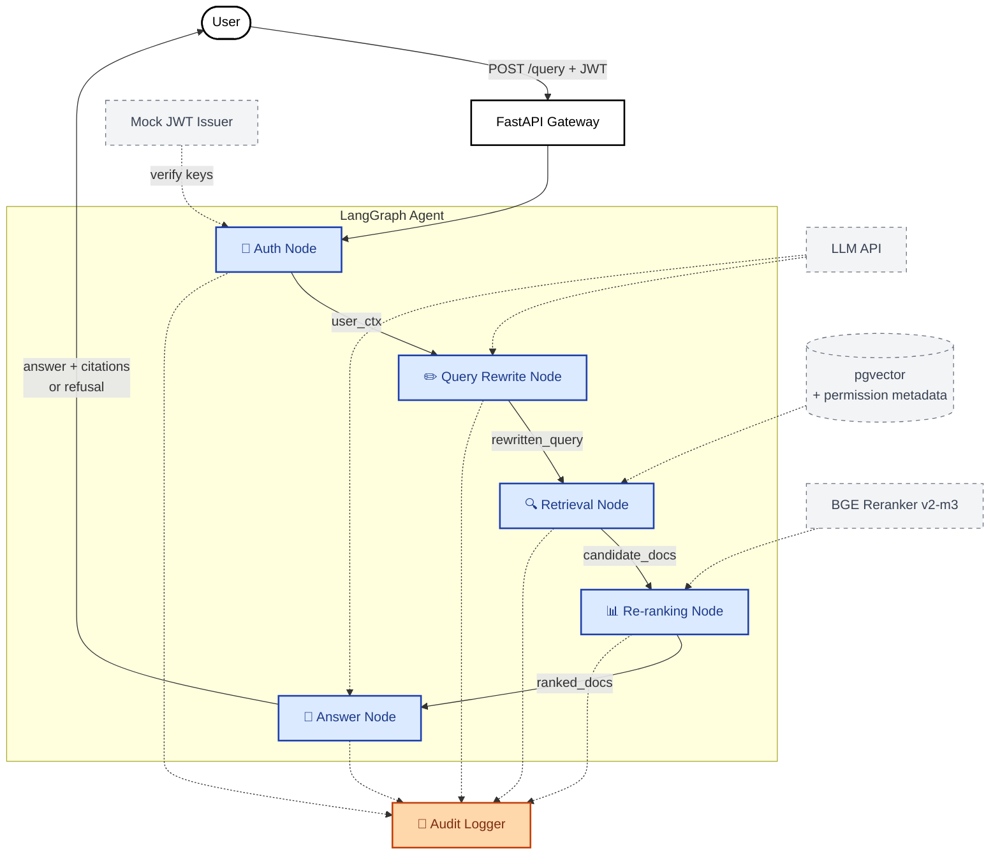

---
title: Permission Aware RAG
colorFrom: indigo
colorTo: blue
sdk: docker
app_port: 7860
pinned: false
short_description: Permission-aware retrieval (RBAC + ReBAC + ABAC)
---

# permission-aware-rag

> Permission-aware RAG with LangGraph for enterprise document search

엔터프라이즈 환경에서 사용자의 IAM 권한(역할·속성)에 따라 검색 가능한 문서 범위가 동적으로 달라지는, LangGraph 기반 멀티에이전트 RAG 시스템.

## 왜 이 프로젝트인가

엔터프라이즈 인증 인프라(ADFS, SAML, OIDC)를 다년간 운영하며 관찰한 한 가지 공백 — 대부분의 RAG 레퍼런스 구현은 *"누구나 모든 문서를 검색할 수 있다"*는 가정 위에서 동작합니다. 실제 기업 환경에서는 사용자의 역할(role)과 속성(attribute)에 따라 접근 가능한 문서가 달라야 하고, 이 차이가 검색 결과·답변 품질·감사 로그에 모두 반영되어야 합니다.

이 프로젝트는 그 공백을 메우기 위한 실험입니다. ReBAC·ABAC 같은 IAM 권한 모델을 RAG 파이프라인에 통합하는 다양한 방식(메타데이터 사전 필터링, 검색 후 필터링, 권한 가중치 반영)을 직접 구현·측정·비교합니다.

> **참고**: 본 프로젝트는 가상의 회사 "BWCorp"를 시나리오로 사용하며, IdP는 FastAPI 기반 mock JWT issuer로 시뮬레이션합니다. 실제 IdP 통합(Keycloak)은 stretch goal로 다룹니다. 실 ADFS/AD 인프라 구축은 본 프로젝트의 RAG 본질을 흐리고 시간 비용 대비 효용이 낮다고 판단해 의도적으로 제외했습니다.

## System Architecture

LangGraph 기반 멀티에이전트 구성:

- **Auth Node** — JWT 검증, 사용자 역할·속성 추출
- **Query Rewrite Node** — 권한 컨텍스트를 반영한 쿼리 재작성
- **Retrieval Node** — Vector DB에서 권한 메타데이터 필터링 + 의미검색
- **Re-ranking Node** — BGE Reranker 기반 권한·관련도 종합 점수
- **Answer Node** — Citation 포함 답변 생성, 권한 부족 시 거부 응답
- **Audit Logger** — 모든 검색·답변 감사 로그

> 모든 노드의 입출력은 별도의 **Audit Logger**에 기록되어 권한 추적과 사후 감사를 지원합니다 (다이어그램 단순화를 위해 일부 연결선 생략).

## Tech Stack

- **Language**: Python 3.13
- **Backend**: FastAPI, LangGraph, LangChain
- **Vector DB**: pgvector (primary), Qdrant (comparison experiment)
- **Re-ranker**: BGE Reranker v2-m3
- **Tracing**: Langfuse or LangSmith
- **Infra**: Hugging Face Spaces (Docker), Supabase (managed Postgres + pgvector)
- **CI/CD**: GitHub Actions

## Roadmap

- [x] **M1: Foundation** — repo 셋업, 시스템 설계, BWCorp 시나리오·데이터 스펙, LangGraph 기초
- [x] **M2: MVP** — FastAPI + pgvector + JWT 인증 + 권한 필터링 + LangGraph 기본 노드 e2e
- [x] **M3: Re-ranking & Evaluation** — BGE Reranker, RAGAS 스타일 평가, 권한 누수 테스트
- [x] **M4: Production Readiness** — sensitivity 기반 권한 모델 마이그레이션, 보안 하드닝, Hugging Face Spaces + Supabase 배포
- [ ] **M5: Polish & Launch** — README 리라이트, 데모 영상, 아키텍처 문서

## Blog Series

진행 과정과 의사결정 기록을 블로그에 공개합니다 — [parkjongmin-ddam.github.io](https://parkjongmin-ddam.github.io)

- [x] 1편: 설계와 구현 (M1+M2)
- [x] 2편: Reranker, audit log 버그, schema drift (M3)
- [ ] 3편: 배포 및 운영 회고 (M4+M5)

## Setup

> 로컬 개발 환경 셋업 가이드는 M5에서 정리 예정. 핵심 흐름:
> 1. `docker compose up` 으로 로컬 pgvector 기동 (또는 Supabase 연결)
> 2. `.env` 에 `DATABASE_URL`, `JWT_SECRET_KEY` 설정
> 3. `uv run python scripts/ingest.py` 로 문서 + 임베딩 적재
> 4. `uv run uvicorn permission_aware_rag.main:app` 로 API 기동

## License

[MIT](LICENSE)